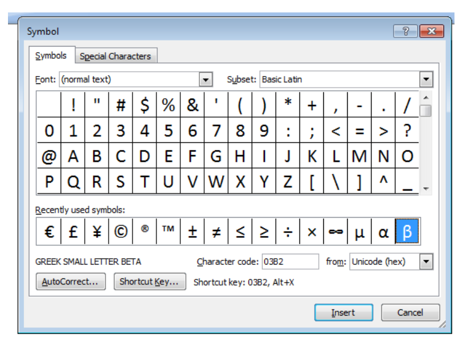

# Chapter 11: Coding Schemes

_Originally created 5 March 2021, by Maxwell Hauser — Updated 7 October 2025._

_Builds upon material from Chapter 7: Unsigned, Signed Magnitude and Signed Two's Complement Binary Numbers._ 

---

## Overview

Each character in ASCII code has a representation using 8 bits, where the most significant bit is used for a parity bit.

**Character Ranges:**
- **Control characters** (non-printable): Hexadecimal 00 to 1F and 7F
  - Examples: NUL, SOH, STX, ETX, ESC, DLE (data link escape)
- **Printable characters:** Hexadecimal 20 to 7E
  - Examples: space, punctuation marks, digits, uppercase letters, lowercase letters

---

## Definitions

**1. ASCII (American Standard Code for Information Interchange)**

ASCII is a character encoding standard for electronic communication. ASCII codes represent text in computers, telecommunications equipment, and other devices that use text. Each character is represented by a **7-bit binary number**, allowing for **128 unique symbols**, including control characters and printable characters.

**2. Extended ASCII**

Extended ASCII is an **8-bit character encoding** that extends the original 7-bit ASCII by adding an additional 128 characters, allowing for a total of **256 unique symbols**. This extension includes additional printable characters, such as accented letters, special symbols, and graphical characters, which are useful for representing text in various languages and applications.

**3. Unicode (Universal Code)**

Unicode is a character-encoding standard for representing characters and numbers in most languages such as Greek, Arabic, Chinese, and Japanese. While ASCII uses 8 bits to represent 256 characters (primarily Latin characters), it does not support mathematical symbols and scientific symbols from other languages.

Since Unicode uses **16 bits** (or more in modern implementations), it can represent **65,536+ characters or symbols**. A character in Unicode is represented by 16-bit binary, equivalent to four digits in hexadecimal. For example, the character B in Unicode is `U+0042` (U represents Unicode).

**ASCII to Unicode Conversion:** The ASCII code is represented between $(00)_{16}$ to $(FF)_{16}$. For converting ASCII code to Unicode, two zeros are added to the left side of ASCII code; therefore, the Unicode to represent ASCII characters is between $(0000)_{16}$ to $(00FF)_{16}$.

Unicode is divided into blocks of code, with each block assigned to a specific language. The following table shows the Unicode for some letters from different alphabets:

| Latin Character | Unicode Hex |
|-----------------|-------------|
| A               | U+0041      |
| B               | U+0042      |
| C               | U+0043      |
| 0               | U+0030      |
| 1               | U+0031      |
| 2               | U+0032      |

| Greek Character | Unicode Hex |
|-----------------|-------------|
| Α               | U+0391      |
| Β               | U+0392      |
| Γ               | U+0393      |

| Cyrillic Character | Unicode Hex |
|--------------------|-------------|
| А                  | U+0410      |
| Б                  | U+0411      |
| В                  | U+0412      |

| Hebrew Character | Unicode Hex |
|------------------|-------------|
| א                | U+05D0      |
| ב                | U+05D1      |
| ג                | U+05D2      |

| Arabic Character | Unicode Hex |
|------------------|-------------|
| ا                | U+0627      |
| ب                | U+0628      |
| ت                | U+062A      |


    Unicode is a universal character encoding standard that aims to provide a unique number for every character, regardless of the platform, program, or language. It supports a wide range of characters from different writing systems, including letters, digits, symbols, and emojis. Unicode can be implemented using different encoding forms, such as UTF-8, UTF-16, and UTF-32, which vary in the number of bytes used to represent each character.

---

## Examples

**Example 11.1:** Represent the word "Hello" in ASCII code.

```
H: 01001000
e: 01100101
l: 01101100
l: 01101100
o: 01101111
```

**Result:** "Hello" in ASCII is `01001000 01100101 01101100 01101100 01101111`.

---


Example 1.21:  Convert the word “Network” to binary and show the result in hexadecimal.  By using Table 1.4 each character is represented by seven bits and results in: 

1001110  1100101   1110100	 1110111  1101111   1110010   1101011
    N	           e	                t	           w				o 	 		   r				k	
 or in hexadecimal 

 4E			65				74			77				6F		      72			6B  			

 


Table 1.4 American Standard Code for Information Interchange ( ASCII)

  Binary      Hex	 Char      	Binary    Hex   Char  Binary    Hex		Char	Binary		Hex	Char   

0000000	00   	NUL		0100000	20	    SP	1000000   40		@ 	      1100000   		 60		’  
0000001		01		SOH		0100001	21		!	1000001 	41		A 		1100001      	 61	 	a               
0000010	02		STX		0100010	22		“	1000010  	42		B		1100010	   	 62		b	
0000011	03		ETX     	0100011	23		#	1000011   	43		C		1100011		63		c
0000100	04		EOT		0100100	24		$	1000100	44		D		1100100		64		d
0000101	05		ENQ		0100101	25		%	1000101	45		E		1100101		65		e
0000110	06		ACK		0100110	26		&	1000110	46		F		1100110		66		f
0000111	07		BEL		0100111	27		‘	1000111	47		G		1100111		67		g
0001000	08		BS			0101000	28		(	1001000	8		H		1101000		68		h 
0001001	09		HT		      0101001 	29		)	1001001	49		I		1101001		69		i
0001010	0A		LF			0101010	2A		*	1001010	4A		J		1101010		6A		j	
0001011	0B		VT			0101011	2B		+	1001011	4B		K		1101011		6B		k
0001100	0C		FF			0101100	2C		,	1001100	4C		L		1101100		6C		l
0001101	0D		CR		0101101	2D		-	1001101	4D		M		1101101		6D		m
0001110	0E		SO			0101110	2E		.	1001110	4E		N		1101110		6E		n
0001111	0F		SI			0101111	2F		/	1001111	4F		O		1101111		6F		o
0010000	10		DLE		0110000	30		0	1010000	50		P		1110000		70		p
0010001	11		DC1		0110001	31		1	1010001	51		Q		1110001		71		q
0010010	12		DC2		0110010	32		2	1010010	52		R		1110010		72		r
0010011	13		DC3		0110011	33		3	1010011	53		S		1110011		73		s
0010100	14		DC4		0110100	34		4	1010100	54		T		1110100		74		t
0010101	15		NACK	0110101	35		5	1010101	55		U		1110101		75		u
0010110	16		SYN		0110110	36		6	1010110	56		V		1110110		76		v
0010111	17		ETB		0110111	37		7	1010111	57		W		1110111		77		w
0011000	18		CAN		0111000	38		8	1011000	58		X		1111000		78		x
0011001	19		EM		0111001	39		9	1011001	59		Y		1111001		79		y
0011010	1A		SUB		0111010	3A		:	1011010	5A		Z		1111010		7A		z
0011011	1B		ESC		0111011	3B		;	1011011	5B		[		1111011		7B		[
0011100	1C		FS			0111100	3C		<	1011100	5C		\		1111100		7C		\
0011101	1D		GS		0111101	3D		=	1011101	5D		]		1111101		7D		}
0011110	1E		RS			0111110	3E		<	1011110	5E		^		1111110		7E		~
0011111	1F		US			0111111	3F		?	1011111	5F		-		1111111		7F		DEL
	
Table 1.6 Unicode Block Allocations

☻

Start Code(Hex) 	End Code(Hex)	Block name
                 
  U0000		               U007F			 Basic Latin
  U0080	            U00FF 		     Latin supplement
  U0370		               U03FF 		     Greek
  U0530		               U058F 		     Armenian
  U0590		               U05FF			 Hebrew
  U0600		               U06FF			 Arabic
  U01A0                    U10FF           Georgian


Example of Unicode:  Open  Microsoft  word and click on  insert  then symbol will result figure 1.10. Click on any character to  display the Unicode value   of the character, for example Unicode for β  is  03B2 in hex 

Figure 1.10  Unicode characters in Microsoft Word:


## Summary

Character encoding schemes are essential for representing text in digital systems. ASCII, Extended ASCII, and Unicode are widely used encoding standards that provide unique binary representations for characters, enabling consistent text representation across different platforms and languages. ASCII is suitable for basic English text, Extended ASCII adds support for additional characters, and Unicode offers a comprehensive solution for representing characters from various writing systems worldwide.
